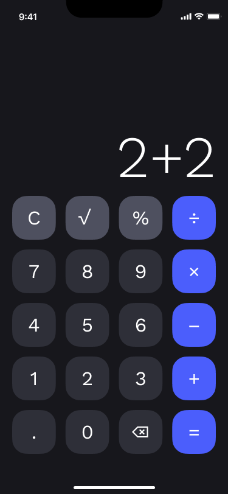

<h1>Calculator App</h1>

Native Android App

## Overview

The Calculator App is a simple and user-friendly calculator designed to perform basic arithmetic operations such as addition, subtraction, multiplication, and division. It also supports additional functions like percentage calculation and square roots.

This app is built using Kotlin and Jetpack Compose for a modern Android development experience.

## Features

- Basic Operations: Addition (+), Subtraction (-), Multiplication (*), Division (/)
- Additional Functions: Percentage (%), Square Root (√), Plus/Minus (+/-)
- Input Formatting: Supports formatting numbers with commas for better readability.
- Clear Functionality: Delete all inputs and reset the calculator.
- Responsive UI: Dynamically adjusts font size based on input length.

### Screenshots
Include some screenshots of the app here to give users an idea of the design and layout.

### Installation
1. Clone the repository: git clone https://github.com/SoeMoeAung060/calculat0r_app.git
2. Open the project in Android Studio.
3. Build and Run the app on an Android device or emulator.

### Usage
- Enter numbers using the keypad.
- Select the operation (e.g., +, -, *, /).
- Enter the second number.
- Press = to get the result.
- Use the C button to clear all inputs.

### Example Calculations:
- Addition: 123 + 456 = 579
- Multiplication: 12 * 8 = 96
- Percentage: 50% of 200 = 100

## Development

### Tech Stack
- **Kotlin:** The primary programming language used.
- **Jetpack Compose:** For building the UI in a declarative way.
- **ViewModel:** To manage the UI-related data.
- **Material Design:** For UI components and overall app styling.
- **Dagger Hilt:** for Dependency Injection

### Code Structure
- CalculatorScreen.kt: Contains the main activity and UI setup.
- CalculatorViewModel.kt: Contains the logic for handling user inputs and performing calculations.
- CalculatorServices.kt: Handles the core mathematical operations like addition, subtraction, etc.

### Key Classes:
- CalculatorViewModel: Manages UI state and calculations.
- CalculatorServicesImpl: Contains logic for arithmetic operations and extra functions like percentage, square root, etc.

### License
This project is licensed under the MIT License. See the [LICENSE](./LINCENSE) file for more details.
